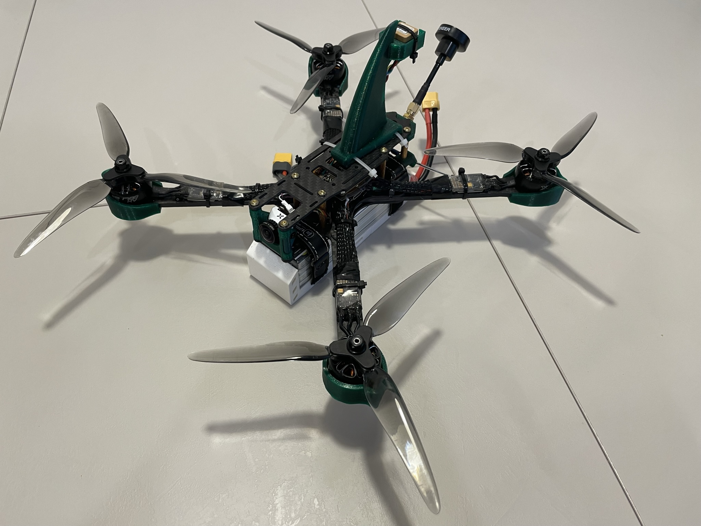
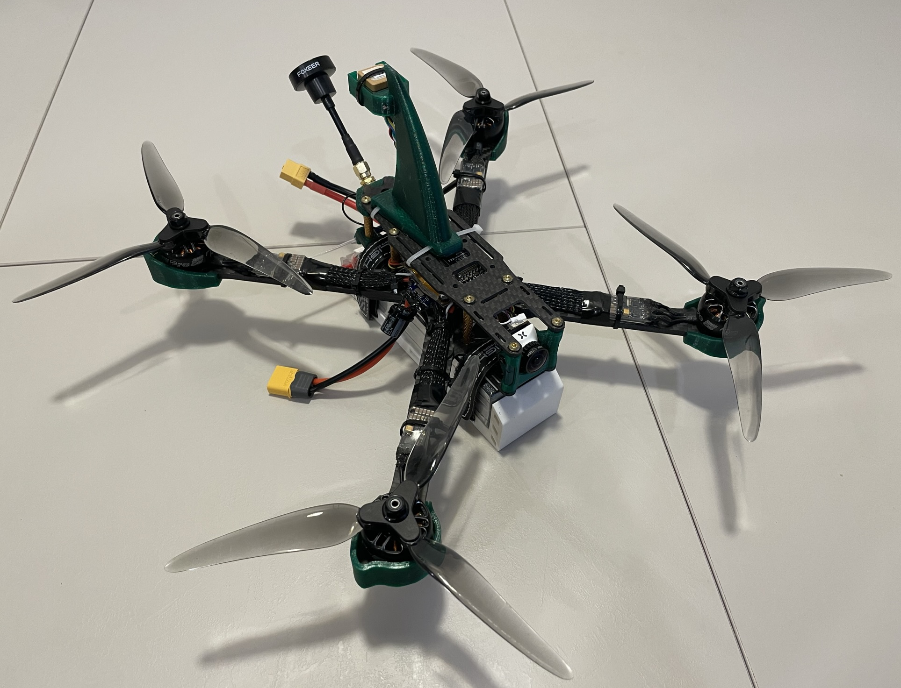
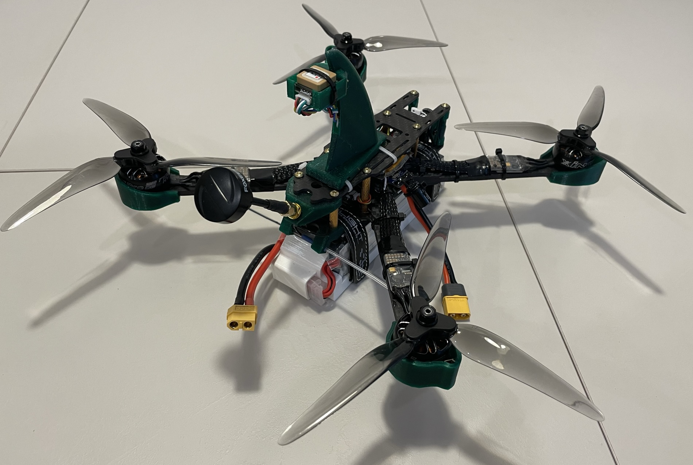
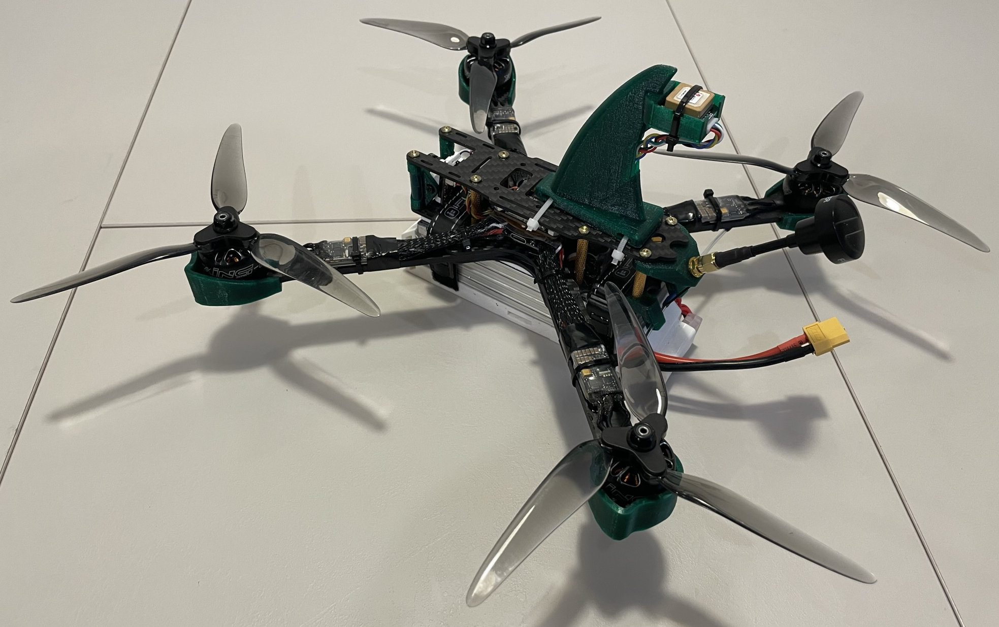
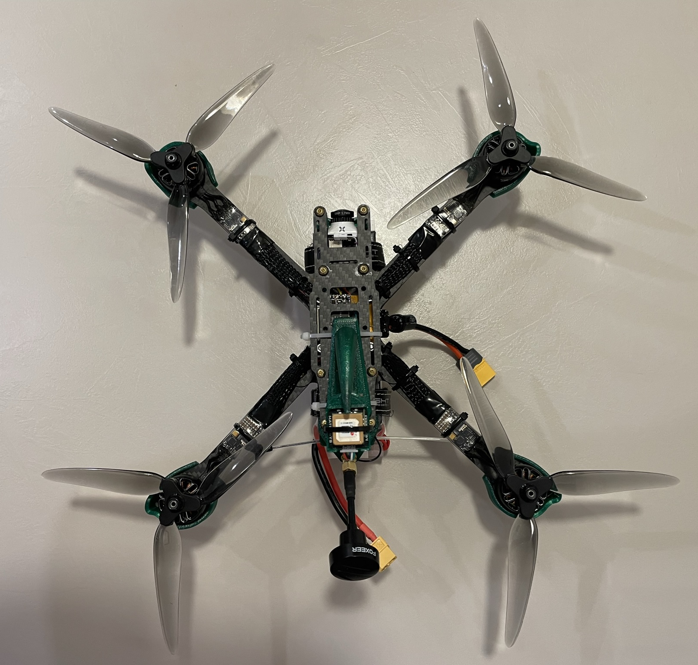

# FPV квадрокоптер-долголет.

Описана моя реализация проекта квадрокоптера-долголета на базе проекта Юлиана RCSchoolmodels.

ВАЖНО! Это не инструкция, а скорее дневник сборки.

Автор изначального проекта: [Юлиан Гиневский RCSchoolmodels](https://vk.com/rcschoolmodelsylian).

Видео, на основе которого сделан проект: [Лучший квадрокоптер-долголет для начинающего! Как собрать, настроить и сделать первый полет!](https://www.youtube.com/watch?v=GBRnG4-c_cc).

Сборка началась 18.11.2022 г. по мере поступления деталей. Описание дополняется...

[Компоненты](components.md)

[STL модели для печати](stl.md)

[Схема подключения компонентов к полетнику](scheme.md)

[Процесс сборки](assembly.md)

[Настройка](settings.md)

Фото в сборке:

