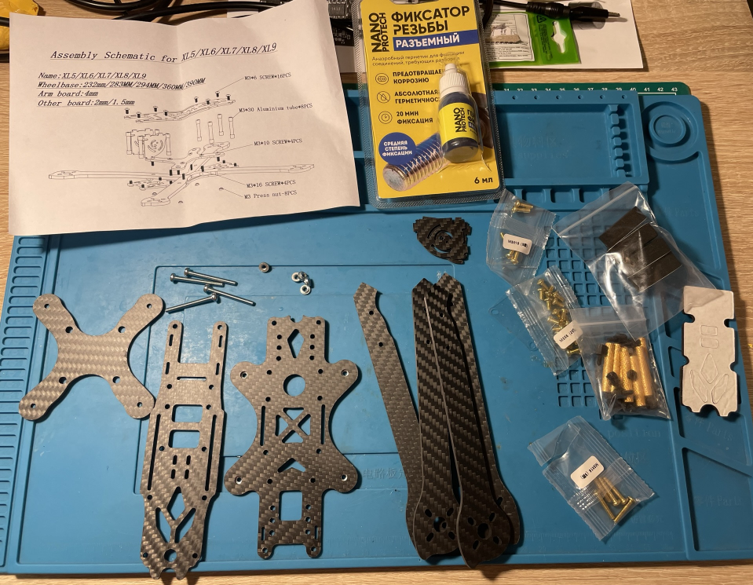
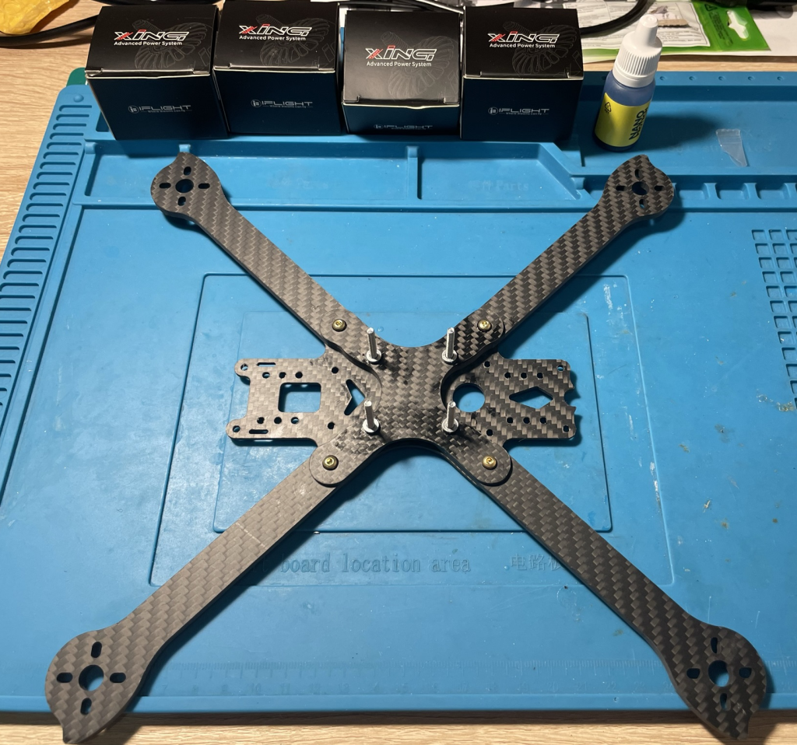
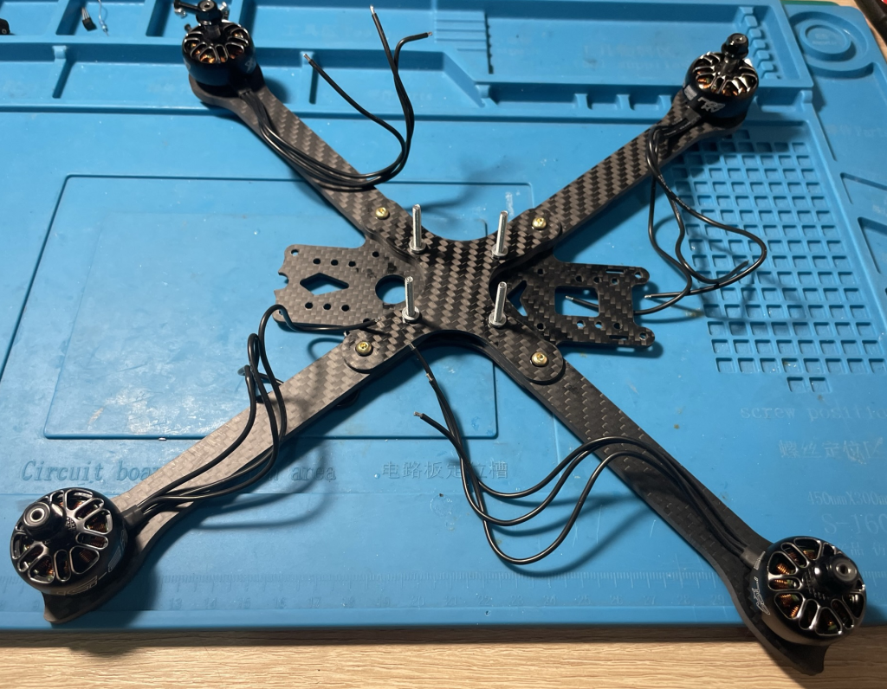
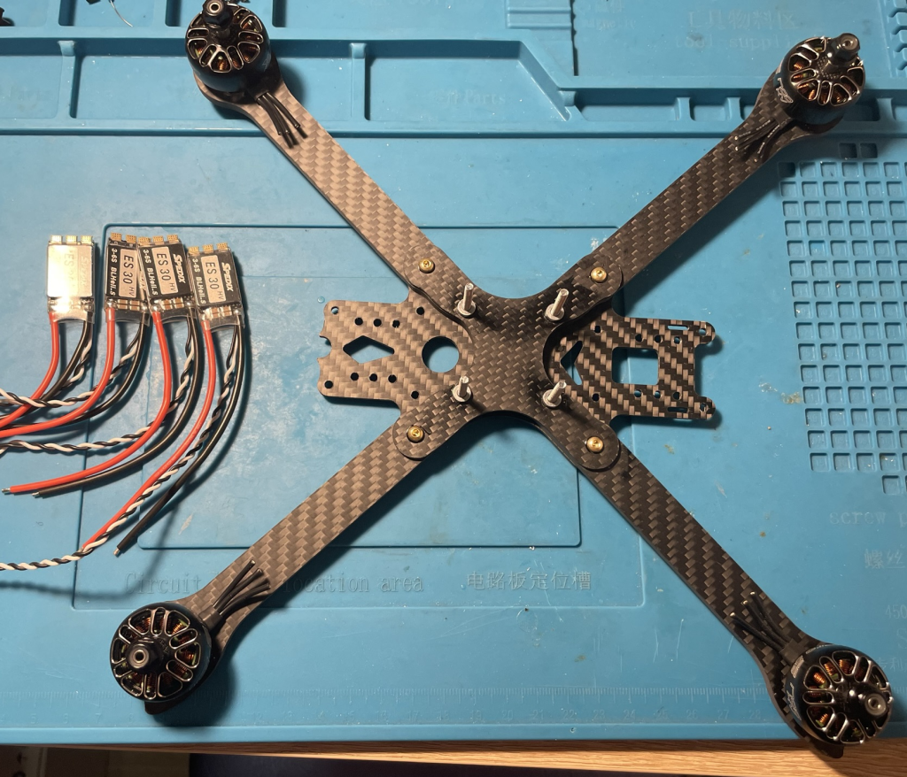
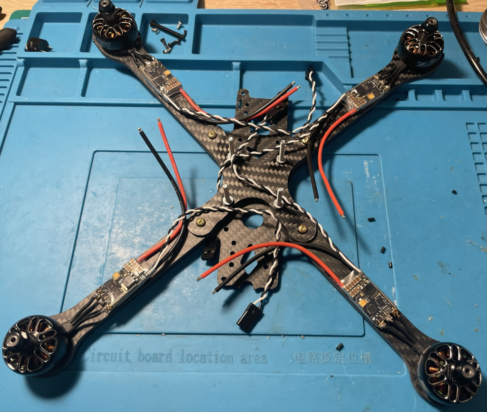
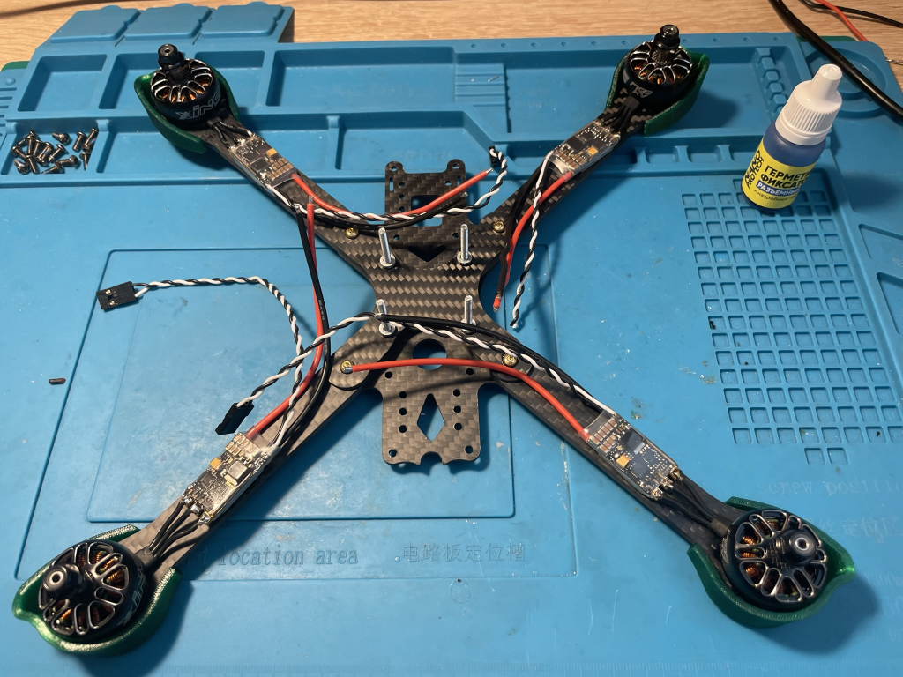
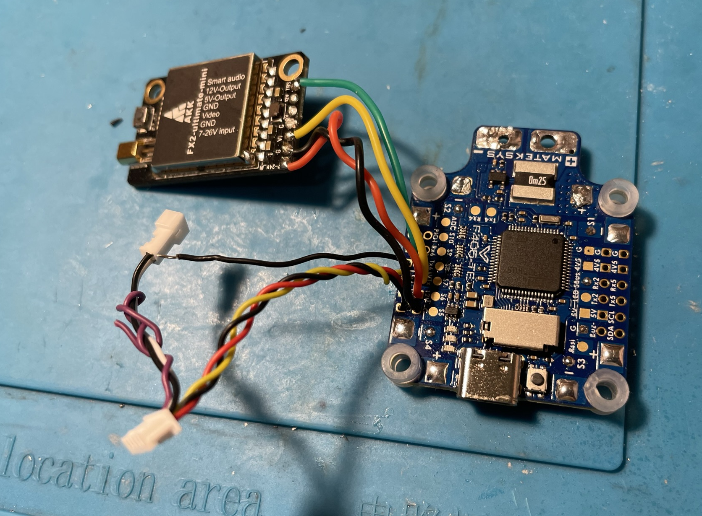
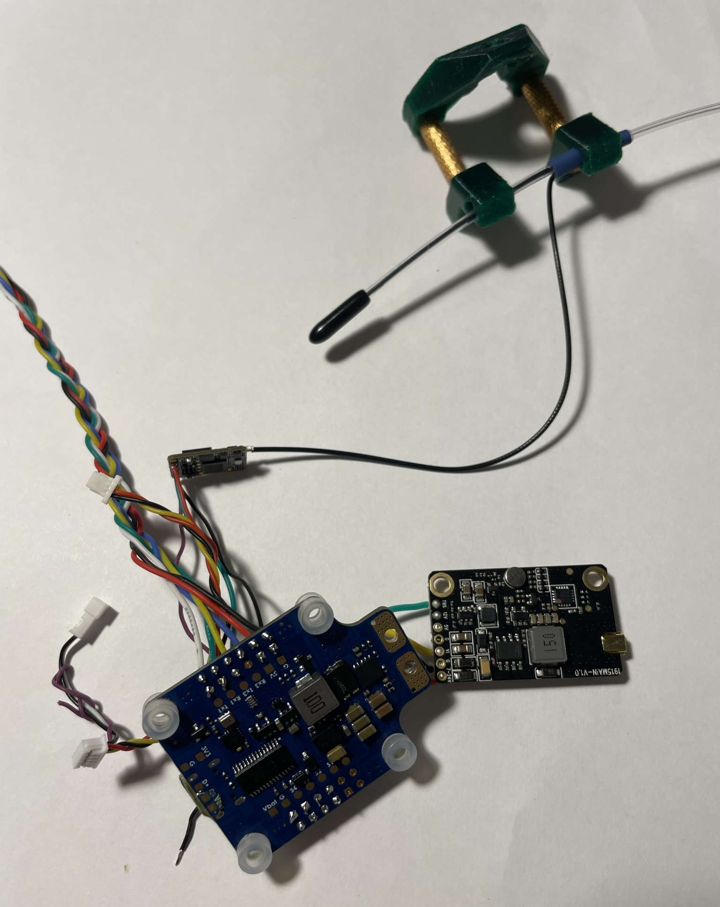

# Процесс сборки

Для всех винтовых соединений использовал фиксатор резьбы.

1. Собрал нижнюю часть рамы с лучами. Винты для крепления полетника заменил на M3x30.
 

2. Установил моторы.

3. Припаял моторы к драйверам.

4. Решил поставить защиту моторов. Пришлось их откручивать. Длины комплектных винтов не хватило - заменил их на M3x10 и добавил шайбы, чтобы не продавливался пластик защиты.
 

5. Припаял к полетному контроллеру передатчик видео, разъем для камеры и провод для экрана. 

6. Припаял к полетному контроллеру бузер, gps и приемник. Покрыл лаком нижнюю сторону (кроме барометра)

