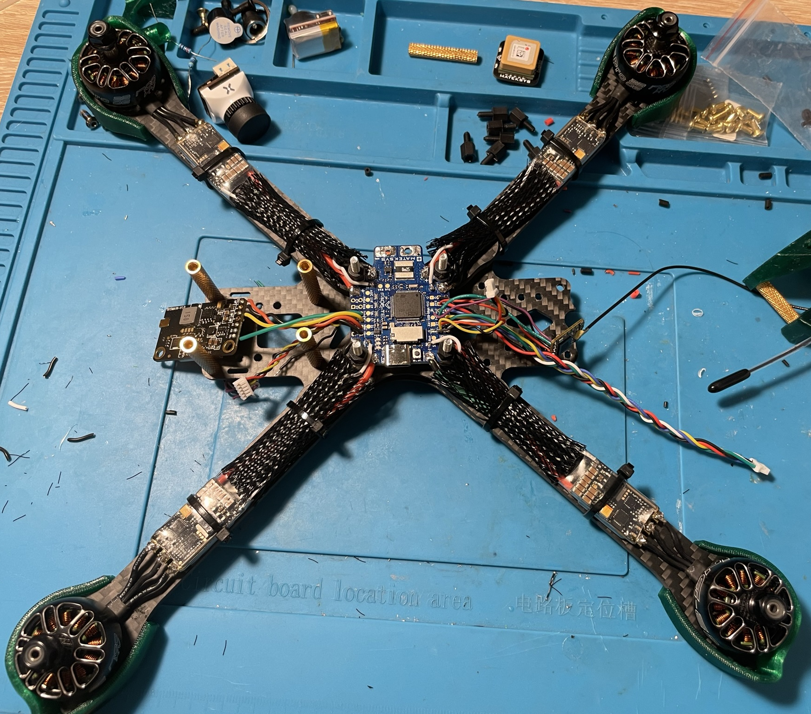
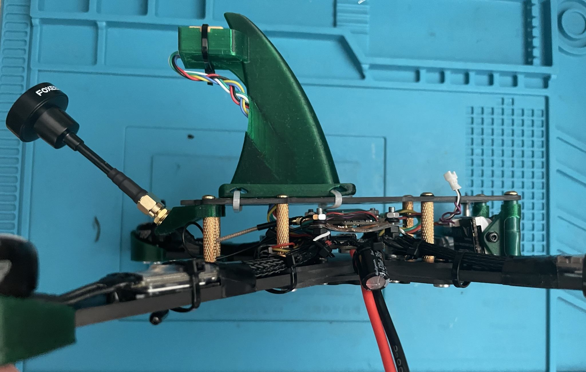
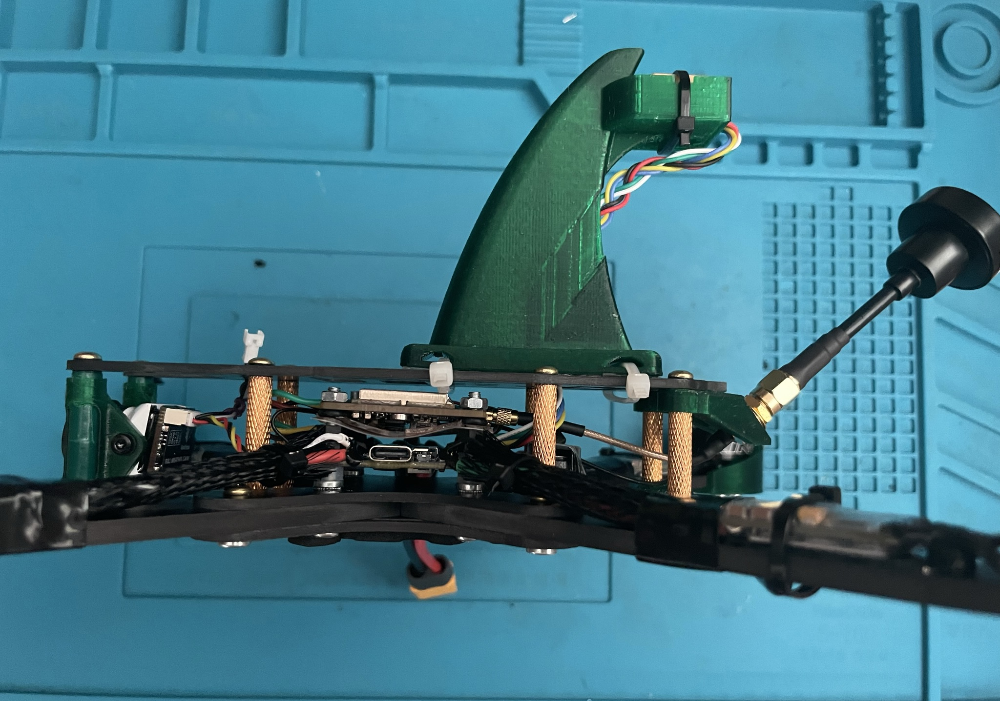

# Процесс сборки

Для всех винтовых соединений использовал фиксатор резьбы.

1. Собрал нижнюю часть рамы с лучами. Винты для крепления полетника заменил на M3x30.
 

2. Установил моторы.

3. Припаял моторы к драйверам.

4. Решил поставить защиту моторов. Пришлось их откручивать. Длины комплектных винтов не хватило - заменил их на M3x10 и добавил шайбы, чтобы не продавливался пластик защиты.
 

5. Припаял к полетному контроллеру передатчик видео, разъем для камеры и провод для экрана. 

6. Припаял к полетному контроллеру бузер, gps и приемник. Покрыл лаком нижнюю сторону (кроме барометра)

7. Поставил полетник на свое место, припаял регуляторы оборотов. Посадил регуляторы на двухсторонний скотч и стяжки.

8. Поставил на место крепления для антенн и видеокамеру. Припаял кабель питания и конденсатор на него. Залил контакты герметиком TIAN Mu 704.

9. Фото дальнейших действий утеряны.  
Между полетным контроллером и видеопередатчиком поставил экранирующую пластинку, подпаял к ней минус с питания. 
Между ней и видеопередатчиком наклеил двухсторонний скотч. Приемник управления приклеил к этому скотчу рядом с видеопередатчиком.
Установил верхнюю часть рамы (винты лучше привинчивать без фиксатора резьбы. Их много и они и так хорошо держатся, а выкручивать их придется регулярно), 
прикрепил к ней плавник на двухсторонний скотч и стяжки. 

