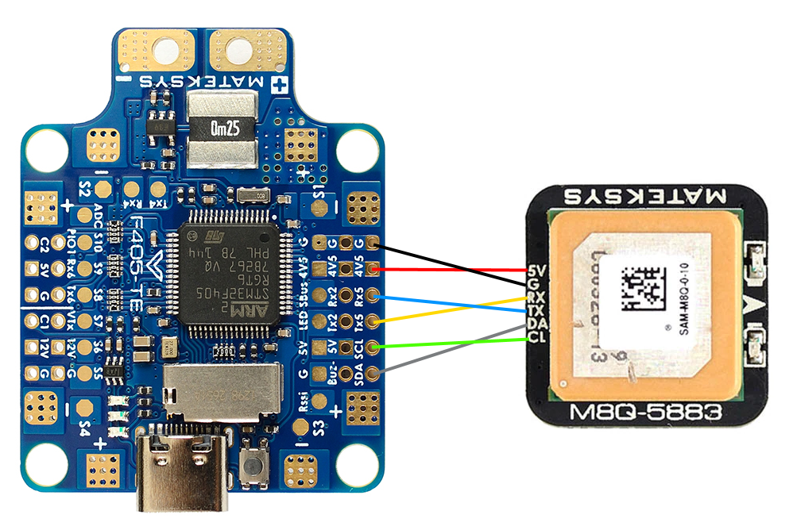

# Схема подключения компонентов к полетнику

Описание полетного контроллера на сайте производителя: [F405-TE](http://www.mateksys.com/?portfolio=f405-te)

## Распиновка от производителя:

## Камера

## Передатчик видео

## Приемник

## Gps

## Бузер (пищалка)

## Esc

## Общая схема подключения компонентов

будет позже...