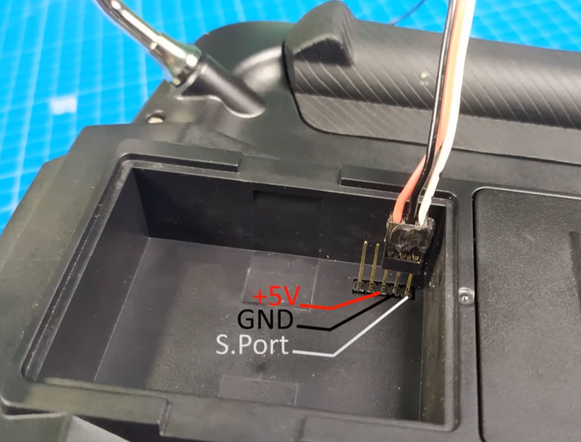

# Настройка

## Пульт, приемник

### Обновление прошивки пульта и модуля R9M

Обновлял прошивку пульта и внутренний мультипротокольный модуль по [инструкции](https://oscarliang.com/flash-edgetx/). 
В пульте уже была установлена EdgeTX, обновил до последней версии (2.8.0).

Прошивку для модуля R9M 2019 скачал с [официального сайта](https://www.frsky-rc.com/r9m-2019/) (ACCST FIRMWARE - R9M FLEX) 

### Обновление прошивки приемника R9 mini

Прошивку скачал с [официального сайта](https://www.frsky-rc.com/r9-mini/) (ACCST FIRMWARE - R9Mini FLEX)

Для прошивки с помощью пульта TX16S приемник надо подключить вместо ВЧ модуля как на фото:

В итоге его можно прошивать как внешний модуль.

Видеоинструкция как обновлять пульт, ВЧ модуль и приемник: [Radiomaster TX16S- Как обновить аппаратуру, мультипротокольный ВЧ модуль и приемники.](https://www.youtube.com/watch?v=XBEd9T3Ygg8)
